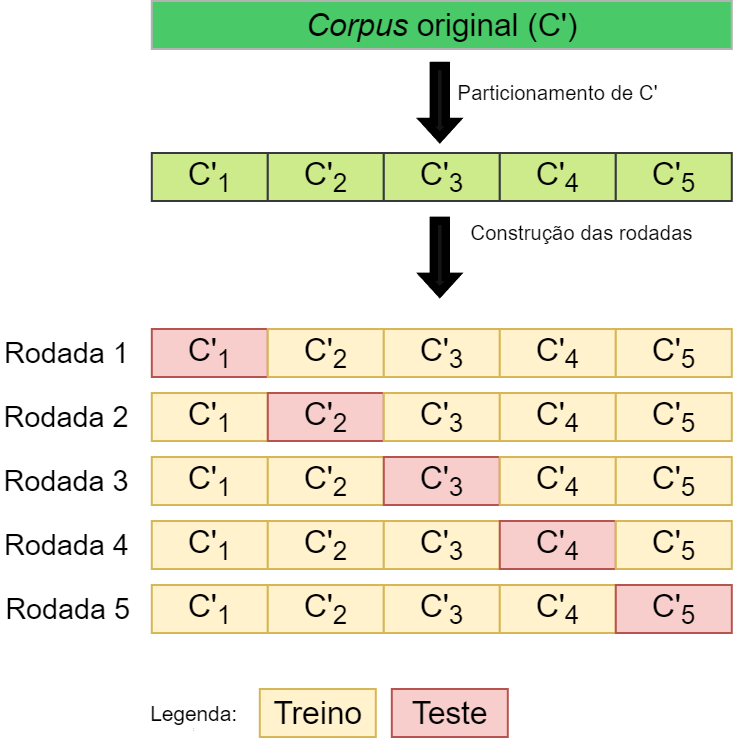

# 1-gerar_csv.ipynb
Neste caderno, é realizada a importação dos vários arquivos JSON, análise do dataset (corpus) construído. Por fim, o dataset é salvo em um CSV, facilitando sua utilização em experimentos. 

Esse _notebook_ contém ainda uma análise detalhada sobre o dataset (corpus) construído.

# 1-kfold.ipynb
Neste trabalho, optou-se por empregar a técnica k-fold, com k=5 e uma amostragem estratificada. Tais escolhas se justificam devido ao tamanho do _dataset_ e desbalanceamento entre as classes.

A figura a seguir ilustra as rodadas formadas a partir de uma amostragem estratificada do dataset original

Este caderno realiza a criação das partições/rodadas, gerando ao final duas listas com objetos do tipo _numpy.array_. Esses objeto funcionam como índices. Por exemplo, a lista _kfold_manual_train_ em sua posição 0 armazena os índices dos elementos do _dataset_ que fazem parte do subsonjunto de treinamento para a rodada _0+1_, _i.e._, rodada 1.
